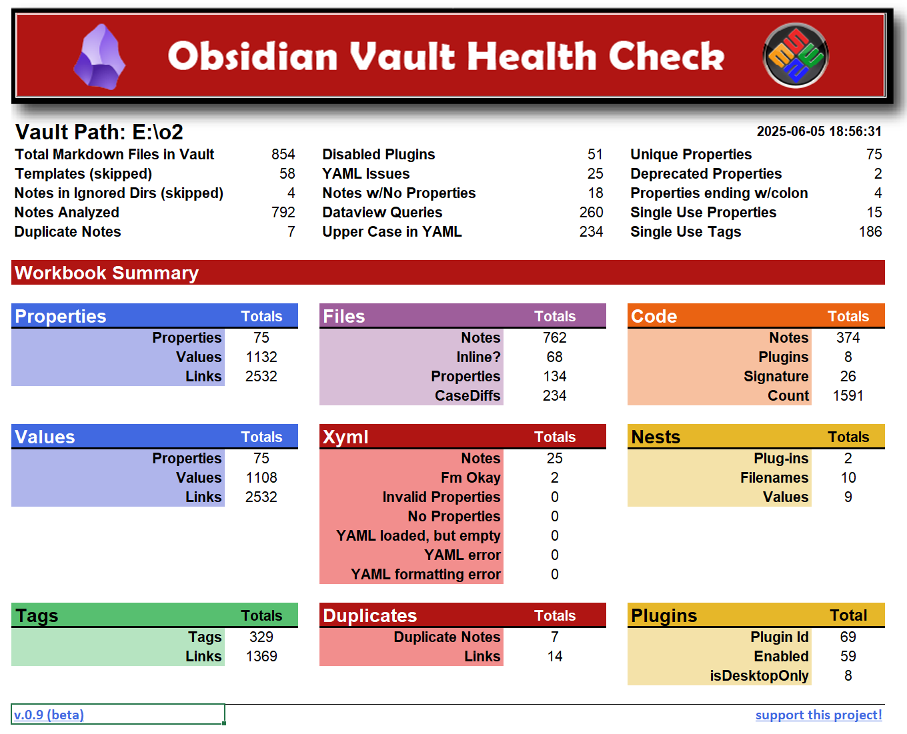

# Obsidian Vault Health Check (beta)

## Produces a Spreadsheet/Workbook of all **Properties**, their **Values**, and **Tags**
This system will run a set of python scripts and read[^1] through all Markdown files in a given vault and gather statistics on all **Properties**, their **Values**, and **Tags** (both frontmatter and inline), producing a spreadsheet for further user analysis. It will also document all duplicates filenames found in the vault, as well as any possibly corrupt YAML[^2]

### Features
- Uses Python to run locally without use of Obsidian or it's API. In this way, it's capable of finding lost tags and misspelled properties.
- All Tags, Properties and their Values are grouped and listed for easy isolation of where they are used in the vault.
- Common issues, such as properties ending with a colon, use of uppercase and deprecated properties, are highlighted.
- Links back to the vault are provided to make it easy for you to review and manually update your vault as you see fit.
- Duplicate notes (same name, in different directories) are also listed in a separate tab.
- Notes with Invalid Properties are also tracked w/likely reasons as to why they may have failed to be processed.
- A detailed list of All Notes (Files) is also maintained that allows tracking of whether the item was frontmatter or in-line, and if uppercase was used.
- Emojii in Note names, Tags, Properties and their Values are supported.
- All codeblocks are listed, with related plugins (if any) and links back to their respective notes.
- Installed plugins are listed with details and whether or not they are enabled.
- Some tracking of *notes maintained by plugins* is supported. (proof of concept)
- A Summary tab of vault statistics is also provided.

### Installation & Setup
1. Download/clone and unpack the repository to a folder
2. Run `setup.py` and fill in the following required values:
   1. The full path of the Obsidian Vault you wish to analyze
   2. The full pathname of your spreadsheet executable
   3. All other options can be left, as is.
3. Click on Save and Run and give it a few seconds to gather statistics
4. When completed, a new, sequentially named spreadsheet will be created and will load automatically.
5. Lastly, please consider buying me, a poor coder (steady there!), a coffee.

Tip: Unless you need to change the setup parameters, you can skip that step by simply running `v_chk.py`, instead.

Note: I am in the process of learning how OOP works, as well as Python, so if you want to read/analyze the code, please be kind ;-). My background in coding is limited and primarily functional. That having been said, this tool works surprisingly well! And hopefully, it's not just me!

Also, if you are new to Obsidian, you may wish to download my one-page, [Obsidan Markdown Cheat Sheet](https://github.com/slappycat2/Obsidian-Markdown-Cheat-Sheet). Again, it's free, open-source, and I hope it helps!

---

[^1]:  As written, theses scripts are "READ-ONLY" as far as your Obsidian Vault is concerned. No changes are written to the vault, no plugins are added and nothing is uploaded to the internet. All data that is gathered is stored locally in the spreadsheets created, and some supporting YAML files. These files will reside in a directory called "data", under the directory where you installed the scripts. 

[^2]: Corrupt is defined as whatever PyYAML 6.0.2 is unable to safe_load.

